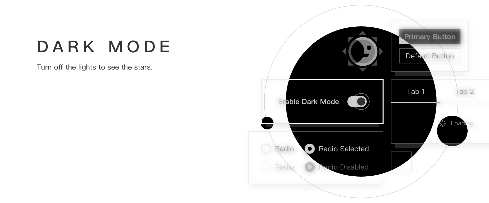

**Qi Design Vue** is a design standard with an implement for web UI components library based on Vue.

文档 | Document: [https://qiqi-1996.github.io/qi-design-vue/](https://qiqi-1996.github.io/qi-design-vue/)

# Features

